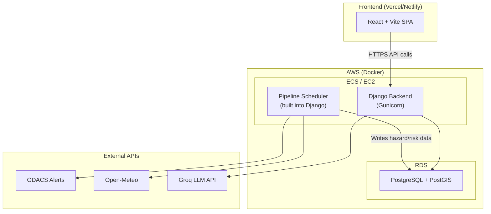

# GeoResilience Platform — Deployment Guide

Complete guide for deploying the GeoResilience platform to production using **Docker**, **AWS**, and **Vercel/Netlify**.

---

## Architecture Overview



---

## Project Structure

```
fyp 2/
├── backend/                  # Django REST API
│   ├── config/               # Django settings, urls, wsgi
│   │   ├── settings.py
│   │   ├── urls.py
│   │   ├── api_views.py      # All API endpoints
│   │   └── wsgi.py
│   ├── hazard/               # Hazard app (includes pipeline scheduler)
│   │   └── apps.py           # Auto-scheduler runs every 15 min
│   ├── network/              # Network graph app
│   ├── risk/                 # Risk engine app
│   ├── requirements.txt
│   ├── manage.py
│   └── .env                  # ⚠ DO NOT commit — secrets
│
├── frontend/                 # React + Vite SPA
│   ├── src/
│   ├── package.json
│   ├── vite.config.js
│   └── .env                  # ⚠ DO NOT commit — API keys
│
├── pipelines/                # Scheduled scripts (hazard_model.py, risk_engine.py)
│   ├── hazard_model.py       # Fetches live data from GDACS, Open-Meteo, RSS
│   └── risk_engine.py        # UNDRR risk = hazard × exposure × vulnerability
│
└── .gitignore
```

---

## 1. Docker Setup

### 1.1 Backend Dockerfile

Create `backend/Dockerfile`:

```dockerfile
# ── Stage 1: Python dependencies ──────────────────────────────────
FROM python:3.11-slim AS base

# System deps for psycopg2 + PostGIS
RUN apt-get update && apt-get install -y --no-install-recommends \
    gcc libpq-dev gdal-bin libgdal-dev \
    && rm -rf /var/lib/apt/lists/*

WORKDIR /app

# Install Python deps
COPY backend/requirements.txt ./requirements.txt
RUN pip install --no-cache-dir -r requirements.txt

# ── Stage 2: Application ──────────────────────────────────────────
FROM base AS app

WORKDIR /app

# Copy backend code
COPY backend/ ./backend/

# Copy pipeline scripts (scheduler spawns them as subprocesses)
COPY pipelines/ ./pipelines/

# Create outputs directory for pipeline logs
RUN mkdir -p /app/backend/outputs

# Set Django settings module
ENV DJANGO_SETTINGS_MODULE=config.settings
ENV PYTHONUNBUFFERED=1
ENV PYTHONDONTWRITEBYTECODE=1

WORKDIR /app/backend

# Collect static files (if any)
RUN python manage.py collectstatic --noinput 2>/dev/null || true

EXPOSE 8000

# Run with Gunicorn — the pipeline scheduler auto-starts inside Django's ready()
# Use --preload so the scheduler starts once, not per-worker
CMD ["gunicorn", "config.wsgi:application", \
     "--bind", "0.0.0.0:8000", \
     "--workers", "2", \
     "--threads", "4", \
     "--timeout", "300", \
     "--preload", \
     "--access-logfile", "-", \
     "--error-logfile", "-"]
```

> [!IMPORTANT]
> The `--preload` flag is **required**. Without it, each Gunicorn worker would spawn its own scheduler thread, causing duplicate pipeline runs.

### 1.2 docker-compose.yml

Create `docker-compose.yml` at the project root:

```yaml
version: "3.9"

services:
  # ── PostgreSQL + PostGIS ────────────────────────────────────────
  db:
    image: postgis/postgis:15-3.3
    restart: always
    environment:
      POSTGRES_DB: ${DB_NAME:-fyp_georesilience}
      POSTGRES_USER: ${DB_USER:-fyp_user}
      POSTGRES_PASSWORD: ${DB_PASSWORD:-fyp_pass}
    volumes:
      - pgdata:/var/lib/postgresql/data
    ports:
      - "5432:5432"
    healthcheck:
      test: ["CMD-SHELL", "pg_isready -U ${DB_USER:-fyp_user}"]
      interval: 5s
      timeout: 5s
      retries: 5

  # ── Django Backend + Pipeline Scheduler ─────────────────────────
  backend:
    build:
      context: .
      dockerfile: backend/Dockerfile
    restart: always
    depends_on:
      db:
        condition: service_healthy
    environment:
      - SECRET_KEY=${SECRET_KEY}
      - DEBUG=False
      - DB_NAME=${DB_NAME:-fyp_georesilience}
      - DB_USER=${DB_USER:-fyp_user}
      - DB_PASSWORD=${DB_PASSWORD}
      - DB_HOST=db
      - DB_PORT=5432
      - GROQ_API_KEY=${GROQ_API_KEY}
      - FRONTEND_URL=${FRONTEND_URL}
      - ALLOWED_HOSTS=${ALLOWED_HOSTS:-*}
    ports:
      - "8000:8000"
    volumes:
      - pipeline_logs:/app/backend/outputs

volumes:
  pgdata:
  pipeline_logs:
```

### 1.3 Environment File for Docker

Create `.env.production` at the project root (this file is used by `docker-compose`):

```bash
# ── Django ──────────────────────────────────────────────
SECRET_KEY=your-production-secret-key-here-min-50-chars
DEBUG=False
ALLOWED_HOSTS=api.yourdomain.com,your-ec2-ip

# ── Database ────────────────────────────────────────────
DB_NAME=fyp_georesilience
DB_USER=fyp_user
DB_PASSWORD=STRONG_PASSWORD_HERE
DB_HOST=db
DB_PORT=5432

# ── External APIs ──────────────────────────────────────
GROQ_API_KEY=gsk_xxxxxxxxxxxxxxxxxxxxxxxxxxxxx

# ── Frontend URL (for CORS) ────────────────────────────
FRONTEND_URL=https://your-app.vercel.app
```

> [!CAUTION]
> **Never commit `.env.production` to Git.** It's already in `.gitignore`. Use AWS Secrets Manager or SSM Parameter Store in production.

### 1.4 Build & Run Locally with Docker

```bash
# Build and start all services
docker-compose --env-file .env.production up --build -d

# Run Django migrations (first time only)
docker-compose exec backend python manage.py migrate

# Check logs
docker-compose logs -f backend

# You should see:
#   [HazardConfig] Pipeline auto-scheduler thread launched
#   [AutoScheduler] ✓ Active — pipeline scheduled every 15 minutes
```

---

## 2. AWS Deployment

### 2.1 Recommended AWS Architecture

| Component | AWS Service | Why |
|-----------|------------|-----|
| **Backend + Pipelines** | ECS Fargate or EC2 | Runs Docker container with Django + scheduler |
| **Database** | RDS PostgreSQL | Managed PostGIS, automated backups |
| **Frontend** | Vercel or Netlify | Free tier, global CDN, auto-deploy from Git |
| **Secrets** | AWS Secrets Manager | Secure env var storage |
| **Domain + SSL** | Route 53 + ACM | Custom domain + free SSL certificates |
| **Load Balancer** | ALB (Application LB) | HTTPS termination, health checks |

### 2.2 Step-by-Step: EC2 Deployment (Simplest for FYP)

> [!TIP]
> For a university FYP, **EC2 + Docker Compose** is the simplest and cheapest option. ECS Fargate is more production-grade but adds complexity.

#### A. Launch EC2 Instance

1. Go to AWS Console → EC2 → Launch Instance
2. Settings:
   - **AMI**: Amazon Linux 2023 or Ubuntu 22.04
   - **Instance type**: `t3.medium` (2 vCPU, 4GB RAM) — minimum for pipeline processing
   - **Storage**: 30 GB gp3
   - **Security Group** — open these ports:

   | Port | Source | Purpose |
   |------|--------|---------|
   | 22 | Your IP | SSH access |
   | 8000 | 0.0.0.0/0 | Backend API |
   | 443 | 0.0.0.0/0 | HTTPS (if using ALB) |

3. Download your `.pem` key file

#### B. Install Docker on EC2

```bash
# SSH into your instance
ssh -i your-key.pem ec2-user@YOUR_EC2_IP

# Install Docker + Docker Compose (Amazon Linux 2023)
sudo dnf update -y
sudo dnf install -y docker
sudo systemctl start docker
sudo systemctl enable docker
sudo usermod -aG docker ec2-user

# Install Docker Compose
sudo curl -L "https://github.com/docker/compose/releases/latest/download/docker-compose-$(uname -s)-$(uname -m)" \
  -o /usr/local/bin/docker-compose
sudo chmod +x /usr/local/bin/docker-compose

# Log out and back in for group changes
exit
ssh -i your-key.pem ec2-user@YOUR_EC2_IP
```

#### C. Deploy Your Code

```bash
# Option 1: Clone from Git
git clone https://github.com/YOUR_USERNAME/YOUR_REPO.git
cd YOUR_REPO

# Option 2: SCP from local machine
scp -i your-key.pem -r "d:/university/semester 7/fyp 2/" ec2-user@YOUR_EC2_IP:~/georesilience/
```

#### D. Set Up Environment & Run

```bash
# Create production env file
nano .env.production
# (paste your production environment variables)

# Build and run
docker-compose --env-file .env.production up --build -d

# Run initial migrations
docker-compose exec backend python manage.py migrate

# Verify the pipeline scheduler is running
docker-compose logs backend | grep "AutoScheduler"
# Should show: [AutoScheduler] ✓ Active — pipeline scheduled every 15 minutes

# Check pipeline runs (after 15 min)
docker-compose logs backend | grep "Pipeline"
```

### 2.3 RDS PostgreSQL Setup (Recommended over Docker PostgreSQL)

For production, use **AWS RDS** instead of the Docker PostgreSQL container:

1. Go to AWS Console → RDS → Create Database
2. Settings:
   - **Engine**: PostgreSQL 15
   - **Template**: Free Tier (or Dev/Test)
   - **Instance**: `db.t3.micro` (free tier) or `db.t3.small`
   - **Storage**: 20 GB gp3
   - **DB name**: `fyp_georesilience`
   - **Master username**: `fyp_user`
   - **Enable PostGIS**: Run `CREATE EXTENSION postgis;` after creation

3. Update your `.env.production`:
```bash
DB_HOST=your-rds-endpoint.xxxxx.us-east-1.rds.amazonaws.com
DB_PORT=5432
```

4. Remove the `db` service from `docker-compose.yml` since RDS handles it.

> [!WARNING]
> Make sure your EC2 security group and RDS security group allow traffic between each other on port 5432.

---

## 3. Frontend Deployment

### 3.1 Vercel (Recommended)

> [!TIP]
> **Vercel is recommended** for Vite + React apps — it has native support, global CDN, automatic HTTPS, and preview deployments on every PR.

#### Steps:

1. **Push frontend to GitHub** (it's already in your repo)

2. **Connect to Vercel**:
   - Go to [vercel.com](https://vercel.com)
   - Sign up / login with GitHub
   - Click "Add New Project" → Import your repo
   - Set the **Root Directory** to `frontend`
   - Framework Preset: **Vite**

3. **Set Environment Variables** in Vercel dashboard:

   | Variable | Value |
   |----------|-------|
   | `VITE_API_URL` | `http://YOUR_EC2_IP:8000/api` or `https://api.yourdomain.com/api` |
   | `VITE_MAPTILER_KEY` | Your MapTiler key |
   | `VITE_CESIUM_TOKEN` | Your Cesium Ion token |

4. **Deploy**: Vercel auto-deploys on every push to `main`.

5. **Custom Domain** (optional):
   - Go to Vercel → Project Settings → Domains
   - Add your domain → follow DNS instructions

#### Build Settings for Vercel:

| Setting | Value |
|---------|-------|
| Build Command | `npm run build` |
| Output Directory | `dist` |
| Install Command | `npm install` |
| Root Directory | `frontend` |

### 3.2 Netlify (Alternative)

1. Go to [netlify.com](https://netlify.com) → New site from Git
2. Connect your GitHub repo
3. Build settings:
   - **Base directory**: `frontend`
   - **Build command**: `npm run build`
   - **Publish directory**: `frontend/dist`
4. Set environment variables (same as Vercel table above)

5. **Important**: Create `frontend/public/_redirects` for SPA routing:
   ```
   /*    /index.html   200
   ```
   This ensures client-side routing works (React Router).

### 3.3 Vercel vs Netlify Comparison

| Feature | Vercel | Netlify |
|---------|--------|---------|
| **Vite support** | ✅ Native | ✅ Good |
| **Free tier** | 100 GB bandwidth | 100 GB bandwidth |
| **Preview deploys** | ✅ Per PR | ✅ Per PR |
| **Custom domains** | ✅ Free | ✅ Free |
| **Edge functions** | ✅ Serverless | ✅ Serverless |
| **Build speed** | ⚡ Faster | Good |
| **Recommended for** | React/Next.js/Vite | Static sites, JAMstack |

**Verdict: Use Vercel** — it's purpose-built for React + Vite.

---

## 4. Environment Variable Management

### 4.1 What Goes Where

| Variable | Where | Secret? |
|----------|-------|---------|
| `SECRET_KEY` | Backend `.env` | ✅ Yes |
| `DB_PASSWORD` | Backend `.env` | ✅ Yes |
| `GROQ_API_KEY` | Backend `.env` | ✅ Yes |
| `DB_HOST` | Backend `.env` | No |
| `DB_NAME`, `DB_USER`, `DB_PORT` | Backend `.env` | No |
| `FRONTEND_URL` | Backend `.env` | No |
| `DEBUG` | Backend `.env` | No |
| `VITE_API_URL` | Frontend `.env` / Vercel | No |
| `VITE_MAPTILER_KEY` | Frontend `.env` / Vercel | ⚠ Semi-public |
| `VITE_CESIUM_TOKEN` | Frontend `.env` / Vercel | ⚠ Semi-public |

> [!WARNING]
> **`VITE_` prefixed variables are embedded in the frontend build** and visible in the browser. Never put secrets there. MapTiler and Cesium tokens are expected to be public-facing (restrict them by domain in their dashboards).

### 4.2 AWS Secrets Manager (Production Best Practice)

Instead of `.env` files on EC2, use AWS Secrets Manager:

```bash
# Store secrets
aws secretsmanager create-secret \
  --name georesilience/backend \
  --secret-string '{
    "SECRET_KEY": "your-production-key",
    "DB_PASSWORD": "your-db-password",
    "GROQ_API_KEY": "gsk_xxxxx"
  }'

# Retrieve in a startup script
export $(aws secretsmanager get-secret-value \
  --secret-id georesilience/backend \
  --query SecretString --output text | \
  python3 -c "import sys,json; [print(f'{k}={v}') for k,v in json.loads(sys.stdin.read()).items()]")
```

### 4.3 Environment Files Summary

You need to create these files (none are committed to Git):

```
fyp 2/
├── .env.production           # Docker Compose reads this (backend secrets)
├── backend/.env              # Local dev only
└── frontend/.env             # Local dev only (Vercel handles prod)
```

---

## 5. Pipeline Scheduling in Production

### 5.1 How It Works

The pipeline auto-scheduler is built into Django's `HazardConfig.ready()` method in `hazard/apps.py`:

```
Server starts → Django loads apps → HazardConfig.ready() →
    Spawns background thread → Checks every 60s →
    If last run ≥ 15 min ago → Runs hazard_model.py → Waits → Runs risk_engine.py
```

**Key behaviors:**
- ✅ Runs exactly every 15 minutes
- ✅ Only starts in server mode (not during migrations/tests)
- ✅ Thread-safe: uses a lock to prevent double-runs
- ✅ Survives pipeline crashes (catches exceptions, retries next cycle)
- ✅ Works with Gunicorn `--preload` (single scheduler thread)

### 5.2 Pipeline Files Required

The scheduler looks for these files in the `pipelines/` directory:

| File | Purpose | Must exist? |
|------|---------|-------------|
| `pipelines/hazard_model.py` | Fetches live hazard data (GDACS, Open-Meteo) | ✅ Yes |
| `pipelines/risk_engine.py` | Computes UNDRR risk scores | ✅ Yes |

> [!IMPORTANT]
> The `pipelines/` directory must be **inside the Docker container** at `/app/pipelines/`. The Dockerfile copies it automatically.

### 5.3 Monitoring Pipeline Health

```bash
# Check scheduler is running
docker-compose logs backend | grep "AutoScheduler"

# Check recent pipeline runs
docker-compose logs backend | grep "Pipeline"

# Check pipeline output logs
docker-compose exec backend ls -la /app/backend/outputs/

# Check last run time via API
curl http://YOUR_EC2_IP:8000/api/hazard/run/
# Returns: {"running": false, "pid": null, "last_run": "20260427_1530"}
```

### 5.4 Alternative: Cron-based Scheduling (if you prefer)

If you want to use system cron instead of the built-in scheduler:

1. Disable the built-in scheduler by removing the `ready()` method
2. Add a cron job:
```bash
# Edit crontab
crontab -e

# Run pipeline every 15 minutes
*/15 * * * * docker-compose -f /path/to/docker-compose.yml exec -T backend python /app/pipelines/hazard_model.py >> /var/log/pipeline.log 2>&1 && sleep 30 && docker-compose -f /path/to/docker-compose.yml exec -T backend python /app/pipelines/risk_engine.py >> /var/log/pipeline.log 2>&1
```

---

## 6. Production Checklist

### 6.1 Security

- [ ] Set `DEBUG=False` in production
- [ ] Generate a strong `SECRET_KEY` (use `python -c "from django.core.management.utils import get_random_secret_key; print(get_random_secret_key())"`)
- [ ] Restrict `ALLOWED_HOSTS` to your domain(s)
- [ ] Restrict `CORS_ALLOW_ALL_ORIGINS` — change to `CORS_ALLOWED_ORIGINS` with specific domains:
  ```python
  CORS_ALLOWED_ORIGINS = [
      os.environ.get('FRONTEND_URL', 'http://localhost:5173'),
  ]
  ```
- [ ] Use HTTPS everywhere (ALB handles SSL termination)
- [ ] Restrict MapTiler and Cesium tokens to your domain in their dashboards
- [ ] Rotate the Groq API key and never expose it in frontend code
- [ ] Use RDS instead of Docker PostgreSQL for data persistence

### 6.2 Performance

- [ ] Use `t3.medium` or larger for EC2 (pipelines need CPU + memory)
- [ ] Enable RDS automated backups
- [ ] Set PostgreSQL `work_mem` and `shared_buffers` appropriately
- [ ] Consider CloudFront CDN in front of the ALB for API caching

### 6.3 Monitoring

- [ ] Enable CloudWatch Logs for Docker container output
- [ ] Set up CloudWatch Alarms for:
  - EC2 CPU > 80% for 5 min
  - RDS free storage < 5 GB
  - Backend health check failures
- [ ] Monitor pipeline run times through the `/api/hazard/run/` endpoint

---

## 7. Quick Deploy Commands

### Full deployment from scratch:

```bash
# 1. SSH to EC2
ssh -i your-key.pem ec2-user@YOUR_EC2_IP

# 2. Clone repo
git clone https://github.com/YOUR_USER/YOUR_REPO.git georesilience
cd georesilience

# 3. Create env file
cat > .env.production << 'EOF'
SECRET_KEY=your-50-char-secret-key-here
DEBUG=False
DB_NAME=fyp_georesilience
DB_USER=fyp_user
DB_PASSWORD=StrongPassword123!
DB_HOST=db
DB_PORT=5432
GROQ_API_KEY=gsk_xxxxxxxxxxxxx
FRONTEND_URL=https://your-app.vercel.app
ALLOWED_HOSTS=YOUR_EC2_IP,api.yourdomain.com
EOF

# 4. Build and start
docker-compose --env-file .env.production up --build -d

# 5. Run migrations
docker-compose exec backend python manage.py migrate

# 6. Verify
docker-compose logs -f backend
# Look for: [AutoScheduler] ✓ Active — pipeline scheduled every 15 minutes

# 7. Test API
curl http://YOUR_EC2_IP:8000/api/hazard/summary/
```

### Update deployment:

```bash
# Pull latest code
cd georesilience
git pull origin main

# Rebuild and restart
docker-compose --env-file .env.production up --build -d

# Check logs
docker-compose logs -f backend
```

---

## 8. Troubleshooting

| Problem | Solution |
|---------|----------|
| Pipeline not running | Check `docker-compose logs backend \| grep AutoScheduler` — verify `hazard_model.py` exists in `pipelines/` |
| Database connection refused | Ensure `DB_HOST=db` (Docker service name) not `localhost` |
| CORS errors in browser | Set `FRONTEND_URL` in backend `.env` to your Vercel URL |
| Frontend can't reach API | Set `VITE_API_URL` in Vercel to `http://EC2_IP:8000/api` |
| Pipeline runs twice | Ensure Gunicorn uses `--preload` flag |
| `hazard_model.py not found` | Check `docker-compose exec backend ls /app/pipelines/` |
| Vercel build fails | Ensure Root Directory is set to `frontend` in Vercel settings |

---

> [!NOTE]
> **For your FYP demo**: The simplest path is EC2 + Docker Compose for backend, Vercel for frontend. Total cost: ~$10-15/month (EC2 t3.micro free tier + RDS free tier). If you just need a demo, a single `t3.medium` spot instance running everything in Docker Compose is the most cost-effective approach.
